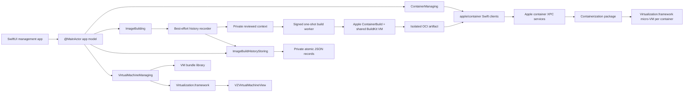

# Architecture

## Principles

1. Use Apple’s public container and virtualization surfaces as the runtime.
2. Keep Apple package types at adapter boundaries so the app’s domain model is
   stable when the actively developed packages change.
3. Never put macOS VMs inside the container runtime abstraction. Container
   micro-VMs, persistent Linux development machines, and general-purpose
   Virtualization.framework VMs have different lifecycles.
4. Keep privileged work out of the GUI process. Installation, DNS resolver
   changes, and service management use the signed Apple installer/runtime or a
   narrowly scoped helper in a later phase.
5. Make every destructive operation explicit and test the state transitions.

## Runtime lanes

### Container lane

The app consumes the library products published by `apple/container` 1.0.0,
initially:

- `ContainerAPIClient` for health, lifecycle, logs, stats, images, and volumes.
- `ContainerResource` for Apple’s snapshots/configuration values at the adapter.
- `MachineAPIClient` for persistent Linux development machines.

The adapter maps those values into small `Sendable`, `Codable`, `Equatable`
domain records. The rest of the app does not import Apple’s client products.
This keeps UI tests fast and isolates package source changes.

The installed Apple services remain the authority for runtime state. The app
does not create a second database of containers, images, networks, or volumes.

Image inventory remains cheap: the global refresh reads reference, digest,
media type, and index-descriptor size only. Selecting an image resolves its OCI
index, manifests, and configs lazily. Mutations cross a narrower `ImageManaging`
adapter and use immutable review plans. Tag replacement, deletion, and prune
therefore re-fetch current references, digests, container usage, and protected
builder/vminit images immediately before acting.

Volume and network mutations cross the parallel `InfrastructureManaging`
facet. Create plans pin absence plus an operation UUID stored in a namespaced
resource label. Delete and prune plans pin the complete intrinsic
configuration identity and every referring container configuration, including
stopped containers. Execution uses the shared runtime mutation coordinator,
re-fetches immediately before mutation, and treats built-in networks and new
references as hard stops. Apple remains the final atomic in-use authority.

Persistent Linux machines cross separate `MachineCreating`,
`MachineLifecycleManaging`, `MachineCommandRunning`, and
`MachineTerminalOpening` facets. `AppleMachineManagementService` owns the
reviewed workflow and shared mutation lease, while
`AppleMachineRuntimeClient` contains Apple package types,
`AppleMachineImagePreparationService` prepares standard OCI-rootfs machines
through public image fetch/unpack APIs without the CLI-oriented flags helper,
`AppleMachineXPCTransport` bounds machine requests with fresh watchdog-closed
connections. `AppleLinuxMachineProcessTargetResolver` invokes readiness and
then re-inspects the complete stable machine identity to capture its fresh
per-boot backing-container ID. `AppleLinuxMachineProcessService` constructs
Apple's `/sbin.machine/init -s` configuration with the persisted mapped user
and machine home, then delegates commands and terminals to shared runtime
process/session services. Creation is cancellable; once durable
state exists, failure or cancellation attempts a graceful stop and then KILLs
only the revalidated backing container. Force Stop requires explicit
authorization and confirms exit. Delete revalidates the complete creation
identity immediately before Apple’s ID-only route, but Apple 1.0 exposes no
conditional delete token, so a narrow external same-name replacement race
remains.

Container creation attachments cross a separate `ContainerAttachmentManaging`
facet. The SwiftUI draft freezes complete volume and network configuration
identities, ordered network selection, normalized guest mount paths, and logical
Unix-socket publications. `AppleContainerAttachmentService` re-lists current
infrastructure and every container configuration under creation's mutation
lease, rejects stale or newly used volumes, preserves the reviewed primary
network, and constructs Apple's mount/network/socket values directly. Empty
legacy requests still resolve Apple's current built-in network, while the UI
always reviews that choice explicitly.

`ApplePublishedSocketWorkspace` is the only service allowed to turn a logical
socket publication into a host path. It uses an operation-labeled, mode-0700
directory under `/private/tmp/nativecontainers-<uid>`, atomically creates and
`lstat`-validates every directory, enforces a conservative macOS Unix-socket
path limit, refuses occupied leaves, and revalidates the exact lexical boundary
before every start. A missing private directory can be safely reconstructed
from the persisted operation identity; stop removes the socket and failed
creation or container deletion removes only that operation directory.

Apple's host alias is global resolver and packet-filter state, not a container
configuration field. `AppleContainerHostAccessService` therefore performs
read-only discovery of exact root-owned resolver, `pf.conf`, and anchor files.
Creation can require one reviewed configured-on-disk identity, but the GUI does
not execute `sudo`, claim PF is currently loaded, or broaden privileges. A
future mutating helper remains a separately signed and notarized service.

Infrastructure, Linux-machine, and runtime-process XPC requests use fresh
connections with cancellation-triggered close and operation-specific close
watchdogs. Machine requests cap at 35 seconds; process create/start uses a
ten-second bound and signal/resize uses two seconds. Process wait connections
have no fixed lifetime deadline so valid shells can remain open, but task
cancellation closes them; setup and one-shot command services impose their own
deadlines and confirmed KILL behavior. Wait and output-drain completion recheck
caller cancellation before returning, so a KILL-induced exit cannot race into a
normal command result. A timeout never implies rollback:
mutations reconcile live state before reporting an outcome. A focused image
service performs public fetch and unpack operations before any machine exists.
Apple 1.0 delete calls accept only a name, not an expected revision, so
narrow external same-name replacement races remain documented rather than
hidden.

Cancellation reconciliation, owned-resource rollback, and inventory refresh
run in fresh tasks so the cancellation that closed the original connection
cannot also cancel recovery. Container rollback uses a dedicated bounded XPC
client: it sends `KILL`, issues force deletion, retries with bounded backoff,
and verifies absence without holding the global mutation lease.

`AppCompositionRoot` constructs one live service graph and shares the same
runtime mutation coordinator across container, infrastructure, and image-build
mutations. `AppModel` depends on named narrow facets through `AppServices`, not
the complete runtime adapter. `AppleRuntimeInventoryService`,
`AppleInfrastructureService`, `AppleContainerCreationService`,
`AppleContainerAttachmentService`, `ApplePublishedSocketWorkspace`,
`AppleContainerHostAccessService`,
`AppleContainerLifecycleService`, `AppleContainerInspectionService`,
`AppleContainerToolService`, `AppleContainerTerminalService`,
`AppleRuntimeCommandExecutor`, `AppleImageService`,
`AppleMachineManagementService`, `AppleLinuxMachineProcessService`,
`AppleOwnedContainerRecoveryService`, and `AppleXPCRequestClient` own their
focused vertical slices. The legacy `AppleContainerService` is a forwarding-only
compatibility facade and owns no runtime behavior.

Browser opening is intentionally outside the service mutation layer. The
service re-fetches the same container creation identity, its running state, and
the exact current TCP publication;
SwiftUI then offers explicit HTTP and HTTPS choices through `openURL`. Wildcard
listeners map to family-matched loopback and `URLComponents` handles IPv6.

Registry credentials use Apple Containerization’s `KeychainHelper` with the
runtime’s exact `com.apple.container.registry` security domain. The settings
model lists host, user, and timestamps only; stored passwords never leave
Keychain. A newly entered secret lives in a secure field just long enough to
ping the registry and save. Registry mutations are serialized and revalidate
the full reviewed metadata immediately before save/delete. Transport is not a
Keychain attribute, so every transfer resolves it separately and must reconfirm
plain-text HTTP.

Interactive terminals remain in this lane. The app asks the bounded
`AppleContainerProcessXPCClient` for a terminal-mode child, transfers duplicated
pipe descriptors through Apple’s XPC boundary, and streams the resulting bytes
into SwiftTerm. Transport and rendering are separate: the service owns process,
descriptor, signal, resize, retention, and cancellation semantics; the AppKit
surface owns VT parsing, drawing, keyboard input, selection, and terminal
protocol replies.

Native builds cross a narrower `ImageBuilding` boundary. Review first copies
the local context beneath a mode-0700 app-owned boundary, preserves the source
POSIX modes that BuildKit exposes to `COPY`, and records a metadata-and-content
fingerprint, Dockerfile and ignore hashes, canonical target tags and current
digests, exact platforms, builder resources, and build flags. A code-signed
one-shot helper owns Apple’s `ContainerBuild.Builder` and its otherwise
unclosable NIO/gRPC lifetime. Before and after dialing, it revalidates the exact
reviewed builder descriptor, creation identity, image digest, DNS configuration,
and socket. It produces an OCI archive under a unique staging reference but
never mutates final tags.

`AppleContainerBuildService` is only the stable facade and single-flight owner.
It composes an `ImageBuildPlanning` service for validation and immutable review,
an `ImageBuildExecuting` service for worker and publication orchestration, and
an `ImageBuildLifecycleManaging` service for discard and cancellation-independent
cleanup. The phases share the same injected staging, secret, artifact, output,
and image-store boundaries, so product wiring stays one call while tests can
replace any phase without constructing the Apple runtime.

Build caching crosses two additional focused boundaries. The worker-owned
`AppOwnedBuildCacheStore` serializes the fixed local profile, validates a fresh
OCI cache export, and atomically moves it from disposable `staging` into a
tokenized `prepared` handoff before releasing the cross-process lease. Its
receipt binds the build ID, opaque token, directory identity, OCI metadata
hashes, and a deterministic metadata tree covering every entry without exposing
a cache path or raw BuildKit string. After private-artifact validation, the host-owned
`ImageBuildCacheFinalizing` service reopens that exact prepared generation and
atomically swaps it into `current`. Inspection may recover abandoned staging
but cannot delete a live prepared handoff; explicit discard/reset owns immediate
cleanup and recovery reclaims handoffs older than 24 hours. Cache status/reset remains a separate `AppOwnedBuildCacheManaging`
service from Apple builder lifecycle.

Build secrets cross a separate `ImageBuildSecretManaging` boundary. The review
request contains file selections, but the immutable plan contains only a
canonical ID, privacy-sensitive path, and byte count. The service rejects invalid or
duplicate IDs, sources inside the build context, links, non-regular files,
foreign owners, multiple links, and any group/world access. It keeps the
security scope and an `O_NOFOLLOW` descriptor open, with device, inode, mode,
owner, link count, size, mtime, and ctime frozen until execution or discard.
Those descriptors are pinned before context staging, which refuses to copy any
matching device/inode and revalidates the review afterward. After shared-builder
preparation, consumption revalidates both path and descriptor, streams with
`pread`, clears its bounded buffer, and destroys the one-shot lease as soon as
the committed pipe envelope is written.

Build history is deliberately outside Apple’s runtime inventory. A
`RecordingImageBuildService` decorates the native `ImageBuilding` service and
best-effort records a running attempt before execution and one typed terminal
outcome afterward. History failure never changes a build result. The separate
`ImageBuildHistoryStoring` actor owns schema-versioned, per-record atomic files,
bounded terminal retention, corruption isolation, live update streams, and
abandoned-launch running-to-interrupted reconciliation guarded by live process
leases. Local notifications plus a cheap directory-token poll keep every visible
model current across app processes; known foreign-running leases are checked for
lock release, slow-load refreshes are coalesced, and unreadable-record warnings
remain latched until explicit clearing. Graceful release removes the current
lease. A separate private-directory service owns descriptor-relative
`openat`/`renameat`/`unlinkat`, bounded enumeration, advisory locking,
nonblocking type checks, ACL removal, file and directory synchronization, and
crash-temp scavenging. History persists only the context display name,
fingerprints and hashes, tags, platforms, option keys and flags, secret count,
timestamps, typed status, digest or retained partial-import references/digests,
typed output kind, and typed failure category. Output destinations, full paths,
argument and label values, secret IDs and paths, logs, and error text never
cross this persistence boundary.

Canonical Dockerfile and ignore paths are checked as strict descendants by
path component, not textual prefix. This accepts directory URLs normalized with
or without a trailing separator while rejecting the context itself and sibling
paths that merely share its name prefix.

The worker returns a typed artifact, never a user destination. Guest-visible
file exports are descriptor-validated, copied into a host-private mode-0400
artifact, and bound to byte count and SHA-256. Local-directory exports cross a
separate private tree store that rejects special files, preserves modes and
symlinks, and fingerprints names, kinds, modes, link targets, and contents. A
focused output service pins the reviewed host parent, revalidates destination
and artifact identities, copies to a hidden sibling with cancellation points,
and commits atomically. Existing files require explicit authorization and a
post-swap identity check; directory outputs must be new. Post-commit failures
retain and report the output rather than deleting it.

Image-store builds additionally revalidate before import, reconcile ambiguous
import/tag XPC failures by re-listing committed state, verify snapshots, and tag
under the same mutation coordinator as image CRUD. Alternate outputs never
mutate the image store. Build execution is cancellation-aware single-flight,
while the long solve stays outside the global mutation lock.

Builder maintenance crosses a separate `ContainerBuilderManaging` service
boundary. Read-only inspection reports stable runtime state and whole-bundle
allocation. Stop, explicit `KILL`, and stopped-only deletion are prepared from
the shared snapshot adapter used by the build worker, then execute under the
image-build lock followed by the global runtime lock. Execution revalidates the
runtime root, creation date, complete pinned identity, and configuration before
the XPC call. Because an XPC mutation may commit before its reply fails,
reconciliation runs in a fresh uncancelled task. Deletion additionally requires
both inventory and the exact builder bundle path to be absent; the service never
manually removes an orphaned bundle or the separate builder-export directory.

Worker protocol v5 reserves stdout for capped length-prefixed control frames
and adds typed output/cache requests and artifact receipts without host destinations.
Its exact-length stdin decoder reads one metadata-only JSON request followed by
a bounded binary secret envelope and final commit marker, then leaves stdin open
as the parent-lifetime lease; secret bytes never enter Codable state, argv,
environment, an app-side `Data`, or a temporary file. Secret-enabled solves force
Apple `Builder.BuildConfig.quiet`, drain
stderr without retaining it, and replace worker failures with a fixed notice.
Ordinary builds retain the bounded plain BuildKit log. The parent consumes
short stdout frames with POSIX `read`, so progress is delivered before worker
exit and cancellation can escalate TERM to KILL while BuildKit is still active.
Cleanup removes both
guest-visible and private artifacts in a cancellation-independent task,
including builds canceled while queued. Context and worker isolation prevent
stale review data and leaked process resources; they do not claim to sandbox a
compromised BuildKit implementation.

The app-owned local cache is a separate focused service. Its wire mode is a
closed enum; raw BuildKit cache strings exist only in the worker adapter. One
cancellation-aware cross-process lease protects a private versioned namespace
across import, solve, export, and artifact isolation. Each solve exports into a
fresh staging generation. The worker validates it and returns only a typed
staged receipt after the primary artifact is private and digest-bound. After the
worker terminal frame arrives, the app revalidates the artifact and a host-side
cache finalizer reacquires the lease, revalidates staging, and atomically swaps
it into `current`. Failed, cancelled, killed, or disconnected workers therefore
cannot replace the last committed generation; lifecycle cleanup or the next
lease scavenges abandoned staging. A committed generation remains valid if a
later image-store or destination publication step fails.
Inspection/reset use the same lock and never mutate Apple's builder container or
unrelated `<appRoot>/builder` exports.

Both sides use POSIX pipe reads for short framed traffic. Foundation’s counted
pipe read can wait for the entire requested buffer or until EOF; the input lease
is intentionally open, and the worker stays alive during a solve, so using it
would deadlock request dispatch or buffer progress until the build had ended.

During foundation development the GUI connects to a matching installed Apple
`container` 1.0.0 service. A distributable product must embed a version-matched,
namespaced build of Apple’s Apache-licensed services and helpers so it can
coexist with the standalone CLI and cannot drift across an incompatible XPC
protocol. The UI adapter stays the same across those deployment modes.

Docker CLI and Compose compatibility are a separate service boundary. Apple’s
core project intentionally exposes OCI/Dockerfile compatibility rather than the
Docker Engine HTTP API. `DockerCompatibilityService` composes a pinned
`SocktainerInstallService`, an exact-process `SocktainerProcessService`, and a
CLI-backed `DockerContextService`; none of those capabilities enter the native
container service graph.

The installer accepts only Socktainer 1.0.0’s reviewed HTTPS asset after its
SHA-256 and Developer ID team both match. Start requires a live Apple 1.0.0 API
server and a real `/_ping` response with Docker API 1.51. The process layer owns
one exact PID and socket inode, escalates TERM to KILL, exposes an immediate
Force Stop, synchronously cleans up on app termination, and offers explicit
stale-socket removal only after three failed listener probes and unchanged
identity. Docker context setup uses supported `docker context create/update`
commands, strips shell context/host overrides for the operation, and confirms
that the user’s active context did not change.

Compose bridge conformance is another independent pure service facet.
`SocktainerComposeConformanceService` evaluates an immutable manifest pinned to
Socktainer 1.0.0, Docker Engine API 1.51, and release revision `876c2fc`.
Each fixture names the exact Engine operations it requires and separately
records semantic limitations or application-policy blocks. Missing operations
fail closed, and new operation cases are not accepted implicitly. The resulting
report is visible in Settings but is explicitly source-pinned evidence rather
than a live Compose execution result. It does not start the bridge, inspect
Apple inventory, or authorize project mutation.

`SocktainerComposeLiveConformanceService` is a separate opt-in execution
boundary. A private workspace facet writes one fixed Alpine fixture with unique,
grammar-validated container, volume, and network names. The runner validates the
Compose model, starts it through the isolated `nativecontainers` context, and
accepts success only after canonical service/volume/network associations appear
through `AppleRuntimeInventoryService` and `ComposeTopologyService`. Every host
command has a deadline; `FoundationHostCommandExecutor` escalates TERM to KILL
and confirms exit when the client hangs.

Cleanup runs in a detached, non-cancellation-inheriting task. It first executes
the reviewed model’s `down --volumes --remove-orphans --timeout 3`. If that
fails, a pure planner accepts only the fixture’s exact names plus canonical
labels, freezes Apple configuration identities, and revalidates each identity
before an Apple-native cleanup facet force-stops/deletes the container and
deletes reviewed network and volume plans. Absence is polled through Apple
inventory before cancellation or the original error is returned. The runner
remains a conformance boundary rather than a user-project mutation action.

`DockerComposeClientInstallService` is the product-owned client boundary. A
release value pins Docker Compose 5.1.4’s official Darwin arm64 binary and SLSA
provenance identities. Separate downloader and validator facets enforce bounded
HTTPS acquisition, private regular-file invariants, both SHA-256 digests, the
thin arm64 Mach-O header, and exact provenance subject/source/builder semantics.
The actor stages and revalidates both artifacts before publishing provenance and
then the executable into a versioned mode-0700 Application Support directory.
It never mutates Docker CLI plugin paths and exposes a checked executable URL
only while the complete installation validates. `AppServices` injects this
facet into the app-scoped Docker compatibility model; Settings observes and
installs it without merging client ownership into Socktainer process ownership.

Compose observability is a separate pure service boundary, not a second runtime
and not part of Socktainer process ownership. `AppleRuntimeInventoryService`
preserves container labels verbatim alongside the existing volume and network
labels. One `ComposeTopologyService` derives a deterministic topology from each
completed inventory refresh and publishes it through `AppModel`. The service is
injectable and synchronous, so previews and tests can replace it without
starting Apple services or the Docker bridge.

Canonical membership requires the Compose project-name grammar plus exact
`com.docker.compose.*` evidence: project and valid service for containers,
project and valid logical-volume name for volumes, and project and valid
logical-network name for non-built-in networks. Project-only containers are
retained as excluded evidence but cannot change counts, observed state, reverse
associations, or lifecycle affordances. Anonymous volumes, invalid optional
labels, built-in networks, and cross-project consumers become visible evidence
notices. Typed associations retain logical Compose keys separately from runtime
resource names. Working-directory and config-file metadata is accepted only
from canonical service containers; conflicting values remain visible rather
than being resolved implicitly. All project views are read-only and link back
to authoritative resource screens. Generic volume prune preserves any resource
with a reserved Compose label.

### General VM lane

VMs live as self-contained bundles in Application Support. Each bundle owns:

- a versioned JSON manifest;
- disk images;
- macOS auxiliary storage when applicable;
- serialized hardware model and machine identifier data;
- optional EFI variable storage for EFI Linux guests;
- saved machine state and thumbnails when supported.

The manifest records relative paths only, allowing a bundle to be moved or
backed up as one unit. Runtime-only objects such as `VZVirtualMachine` never go
into the manifest.

Downloaded macOS IPSWs are intentionally outside this boundary in the app cache
so multiple VMs can reuse one multi-gigabyte installer. The manifest records its
selected local URL, while the hardware model, machine identifier, and auxiliary
storage derived from that image remain bundle-owned and are promoted
transactionally.

Locally selected IPSWs are imported into that same private cache while the file
picker's security scope is active. The importer streams cancellable chunks to a
partial file and promotes only a complete copy, so later installation never
depends on an expired external-file grant. A durable pending marker lets launch
recovery delete an orphaned import after a crash while preserving any image a
persisted manifest already references. A private advisory lock prevents another
app process—or actor-reentrant recovery—from treating an active import as
abandoned.

The VM library owns only durable bundle state. A strict bundle resolver turns a
prepared manifest into verified regular-file URLs. For each attempt the library
creates an operation-scoped sparse disk and auxiliary-storage copy. A dedicated
installation service validates that staged configuration, acquires an
operation-ID lease, and delegates to a main-actor installer session. Success
renames the staged directory and atomically points the manifest at it; failure,
cancellation, or relaunch recovery removes the staged media and returns the
pristine prepared VM to a retryable state. Completion and recovery can mutate
the manifest only while the expected lease remains current. A library-wide
advisory lock extends that ownership boundary across app processes, and VM
discard first atomically renames a bundle to a hidden tombstone so interrupted
recursive cleanup cannot poison inventory reads. Runtime-only
`VZVirtualMachine`, `VZMacOSInstaller`, progress observation, and cancellation
state never enter persistence.

### UI lane

The SwiftUI shell uses a `NavigationSplitView` with separate screens for:

- Overview
- Containers
- Images
- Volumes
- Linux Machines
- macOS VMs
- Settings and diagnostics

An `@MainActor @Observable` app model owns prepared, stable-identity view data.
Feature views take narrow values. AppKit bridges are intentionally narrow:
`NSViewRepresentable` wraps SwiftTerm’s `TerminalView` for container shells and
`VZVirtualMachineView` for VM display. SwiftUI remains the source of truth for
selection and lifecycle commands.

Workspace navigation is a separate focused slice. `WorkspaceRoute` represents
both top-level destinations and exact resource identities. A pure
`WorkspaceResourceCatalog` derives searchable entries from the current Apple
inventory and VM library without persisting a second index. The main-actor
`WorkspaceNavigationModel` owns the active route, prepared search results, and
Quick Open presentation. Inventory replacement reconciles a missing exact
resource back to its safe top-level destination only after that resource's
service completed an authoritative refresh. A transient runtime failure may
clear visible entries, but it preserves the pending exact route so recovery can
restore the same selection. Localized resource-kind titles join stable runtime
identities and familiar CLI aliases in the search index. Overview links, list
selection, sidebar state, and Command-K therefore use one route, while a
reviewed or active build still locks every path away from Builds. The app uses
one unique main `Window`, matching this app-scoped navigation ownership rather
than sharing presentation state across an implied multi-window group.

## Persistence and safety

- Inventory refreshes are read-only and can run concurrently.
- Lifecycle mutations are serialized per resource identifier.
- Writes use temporary files plus atomic replacement.
- VM creation is staged so cancellation cannot leave a valid-looking partial
  bundle.
- VM installation validates staged media before taking its lease, rejects stale
  lease completion, and treats a persisted lease with no live session as
  interrupted. Installer cancellation uses `Progress.cancel()` only after
  installation has started and waits for termination; pause and force-stop are
  forbidden during installation because Virtualization.framework defines them
  as unsafe.
- Installed macOS VMs use an app-scoped runtime coordinator and a short-held
  library mutation lock to acquire a per-bundle runtime lease. Runtime state is
  ephemeral and never changes the installation manifest. Every session has a
  fresh generation; lifecycle commands, destructive stop authorization, and
  console attachment must match it. Delegate stop/error events are the
  authoritative terminal signal and release the disk lease exactly once.
- A graceful stop request leaves the VM in a stopping state with an explicit
  Force Stop action. Force Stop wraps Apple's destructive stop API and does not
  claim the VM stopped when the framework reports an error. A service-owned,
  generation-pinned watchdog invokes that same path after a 30-second graceful
  shutdown timeout. Its wait for Apple’s `canStop` capability is bounded and a
  terminal delegate event cancels it immediately; view lifetime and caller
  cancellation never arm or cancel it.
- macOS VM suspension is split across three focused layers: the runtime service
  owns the generation-safe lifecycle state machine, the saved-state service
  sequences Virtualization.framework callbacks, and the saved-state store owns
  filesystem transactions. Save transactions hold a borrow on the runtime lease,
  write into a hidden partial directory, fully synchronize the state and metadata,
  then atomically publish `SavedState`. Restore atomically renames that directory
  to a single-use tombstone before invoking Virtualization.framework; every
  attempted restore consumes it, and crash recovery deletes restore tombstones
  instead of replaying them.
- Saved-state metadata binds the checkpoint to a shared configuration descriptor,
  opaque platform artifact digests, and writable disk/auxiliary-storage identity.
  The descriptor also supplies the deterministic locally administered MAC used by
  the live VZ configuration, avoiding Apple's random default. Starting fresh and
  resuming a live paused session explicitly discard an older checkpoint before
  writable storage can advance.
- Force Stop remains available during start, save, and restore. A generation-pinned
  monitor issues destructive stop as soon as Virtualization.framework reports that
  stop is available, even if the original callback is still pending. The UI reports
  that the VM is stopped but cleanup is pending, and the runtime lease is never
  released until the save/restore callback and persistence cleanup quiesce.
- Shared-directory configuration is a separate private sidecar inside the VM
  bundle. UI models call a narrow management service; that service serializes
  stopped-only mutations through the existing runtime lease and saved-state
  inspector; the library owns monotonic atomic persistence; the bookmark service
  owns security-scoped access; and the Apple factory owns the single automounted
  VirtioFS device. Runtime acquisition locks the bundle before reading the
  sidecar, and the engine session closes its access lease explicitly.
- Build contexts are staged without following links and re-fingerprinted before
  and after the BuildKit solve; exported archives are copied into a private,
  digest-bound host artifact; final tags are revalidated immediately before
  mutation.
- Build history uses an ACL-free mode-0700 current-user directory and ACL-free
  mode-0600 atomic records through a verified directory descriptor. Corrupt or
  special records are isolated without blocking, newer schemas are retained,
  live-launch leases prevent false interruption, bounded scans fail closed, and
  retention happens after the replacement is durable while bounding terminal
  records.
- Image-build and builder-management workspace models have app-level identity.
  Reviewed plans and active operations lock navigation away from Builds, while
  the owning view exposes cancellation for every locked asynchronous action.
- Named attachments are revalidated after review. Published sockets can only
  occupy a private operation directory, are checked before each start, and are
  removed on stop/delete or owned creation rollback.
- Credentials stay in Keychain through Apple’s registry client facilities.
- No container or VM is deleted without a confirmation that names the affected
  disks and snapshots.

## Compatibility policy

- App deployment target: macOS 26.
- Host architecture: Apple silicon.
- `apple/container`: pin exact release 1.0.0 initially.
- Client and server builds must match until Apple adds API negotiation.
- Direct `containerization`: inherited from the pinned `container` release;
  avoid adding a second version to the dependency graph.
- Virtualization API use is verified against the installed SDK with Xcode
  documentation search, the compiler, and runtime checks.
