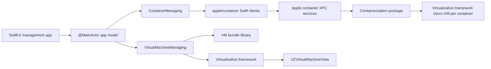

# Architecture

## Principles

1. Use Apple’s public container and virtualization surfaces as the runtime.
2. Keep Apple package types at adapter boundaries so the app’s domain model is
   stable when the actively developed packages change.
3. Never put macOS VMs inside the container runtime abstraction. Container
   micro-VMs, persistent Linux development machines, and general-purpose
   Virtualization.framework VMs have different lifecycles.
4. Keep privileged work out of the GUI process. Installation, DNS resolver
   changes, and service management use the signed Apple installer/runtime or a
   narrowly scoped helper in a later phase.
5. Make every destructive operation explicit and test the state transitions.

## Runtime lanes

### Container lane

The app consumes the library products published by `apple/container` 1.0.0,
initially:

- `ContainerAPIClient` for health, lifecycle, logs, stats, images, and volumes.
- `ContainerResource` for Apple’s snapshots/configuration values at the adapter.
- `MachineAPIClient` for persistent Linux development machines.

The adapter maps those values into small `Sendable`, `Codable`, `Equatable`
domain records. The rest of the app does not import Apple’s client products.
This keeps UI tests fast and isolates package source changes.

The installed Apple services remain the authority for runtime state. The app
does not create a second database of containers, images, networks, or volumes.

During foundation development the GUI connects to a matching installed Apple
`container` 1.0.0 service. A distributable product must embed a version-matched,
namespaced build of Apple’s Apache-licensed services and helpers so it can
coexist with the standalone CLI and cannot drift across an incompatible XPC
protocol. The UI adapter stays the same across those deployment modes.

Docker CLI and Compose compatibility are a separate service boundary. Apple’s
core project intentionally exposes OCI/Dockerfile compatibility rather than the
Docker Engine HTTP API. The first implementation candidate is the
Apache-licensed [Socktainer](https://github.com/socktainer/socktainer) bridge,
version-pinned and tested against an explicit compatibility suite.

### General VM lane

VMs live as self-contained bundles in Application Support. Each bundle owns:

- a versioned JSON manifest;
- disk images;
- macOS auxiliary storage when applicable;
- serialized hardware model and machine identifier data;
- optional EFI variable storage for EFI Linux guests;
- saved machine state and thumbnails when supported.

The manifest records relative paths only, allowing a bundle to be moved or
backed up as one unit. Runtime-only objects such as `VZVirtualMachine` never go
into the manifest.

### UI lane

The SwiftUI shell uses a `NavigationSplitView` with separate screens for:

- Overview
- Containers
- Images
- Volumes
- Linux Machines
- macOS VMs
- Settings and diagnostics

An `@MainActor @Observable` app model owns prepared, stable-identity view data.
Feature views take narrow values. The sole AppKit bridge is an
`NSViewRepresentable` around `VZVirtualMachineView`; SwiftUI remains the source
of truth for selection and lifecycle commands.

## Persistence and safety

- Inventory refreshes are read-only and can run concurrently.
- Lifecycle mutations are serialized per resource identifier.
- Writes use temporary files plus atomic replacement.
- VM creation is staged so cancellation cannot leave a valid-looking partial
  bundle.
- Credentials stay in Keychain through Apple’s registry client facilities.
- No container or VM is deleted without a confirmation that names the affected
  disks and snapshots.

## Compatibility policy

- App deployment target: macOS 26.
- Host architecture: Apple silicon.
- `apple/container`: pin exact release 1.0.0 initially.
- Client and server builds must match until Apple adds API negotiation.
- Direct `containerization`: inherited from the pinned `container` release;
  avoid adding a second version to the dependency graph.
- Virtualization API use is verified against the installed SDK with Xcode
  documentation search, the compiler, and runtime checks.
