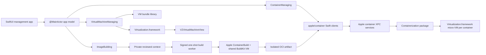

# Architecture

## Principles

1. Use Apple’s public container and virtualization surfaces as the runtime.
2. Keep Apple package types at adapter boundaries so the app’s domain model is
   stable when the actively developed packages change.
3. Never put macOS VMs inside the container runtime abstraction. Container
   micro-VMs, persistent Linux development machines, and general-purpose
   Virtualization.framework VMs have different lifecycles.
4. Keep privileged work out of the GUI process. Installation, DNS resolver
   changes, and service management use the signed Apple installer/runtime or a
   narrowly scoped helper in a later phase.
5. Make every destructive operation explicit and test the state transitions.

## Runtime lanes

### Container lane

The app consumes the library products published by `apple/container` 1.0.0,
initially:

- `ContainerAPIClient` for health, lifecycle, logs, stats, images, and volumes.
- `ContainerResource` for Apple’s snapshots/configuration values at the adapter.
- `MachineAPIClient` for persistent Linux development machines.

The adapter maps those values into small `Sendable`, `Codable`, `Equatable`
domain records. The rest of the app does not import Apple’s client products.
This keeps UI tests fast and isolates package source changes.

The installed Apple services remain the authority for runtime state. The app
does not create a second database of containers, images, networks, or volumes.

Image inventory remains cheap: the global refresh reads reference, digest,
media type, and index-descriptor size only. Selecting an image resolves its OCI
index, manifests, and configs lazily. Mutations cross a narrower `ImageManaging`
adapter and use immutable review plans. Tag replacement, deletion, and prune
therefore re-fetch current references, digests, container usage, and protected
builder/vminit images immediately before acting.

Volume and network mutations cross the parallel `InfrastructureManaging`
facet. Create plans pin absence plus an operation UUID stored in a namespaced
resource label. Delete and prune plans pin the complete intrinsic
configuration identity and every referring container configuration, including
stopped containers. Execution uses the shared runtime mutation coordinator,
re-fetches immediately before mutation, and treats built-in networks and new
references as hard stops. Apple remains the final atomic in-use authority.

Container creation attachments cross a separate `ContainerAttachmentManaging`
facet. The SwiftUI draft freezes complete volume and network configuration
identities, ordered network selection, normalized guest mount paths, and logical
Unix-socket publications. `AppleContainerAttachmentService` re-lists current
infrastructure and every container configuration under creation's mutation
lease, rejects stale or newly used volumes, preserves the reviewed primary
network, and constructs Apple's mount/network/socket values directly. Empty
legacy requests still resolve Apple's current built-in network, while the UI
always reviews that choice explicitly.

`ApplePublishedSocketWorkspace` is the only service allowed to turn a logical
socket publication into a host path. It uses an operation-labeled, mode-0700
directory under `/private/tmp/nativecontainers-<uid>`, atomically creates and
`lstat`-validates every directory, enforces a conservative macOS Unix-socket
path limit, refuses occupied leaves, and revalidates the exact lexical boundary
before every start. A missing private directory can be safely reconstructed
from the persisted operation identity; stop removes the socket and failed
creation or container deletion removes only that operation directory.

Apple's host alias is global resolver and packet-filter state, not a container
configuration field. `AppleContainerHostAccessService` therefore performs
read-only discovery of exact root-owned resolver, `pf.conf`, and anchor files.
Creation can require one reviewed configured-on-disk identity, but the GUI does
not execute `sudo`, claim PF is currently loaded, or broaden privileges. A
future mutating helper remains a separately signed and notarized service.

Infrastructure XPC requests use a fresh connection with cancellation-triggered
close and a 60-second close watchdog. A timeout never implies rollback: create
and delete reconcile live state and the operation label before reporting an
outcome. Apple 1.0 delete calls accept only a name, not an expected revision, so
a narrow external same-name replacement race remains documented rather than
hidden.

Cancellation reconciliation, owned-resource rollback, and inventory refresh
run in fresh tasks so the cancellation that closed the original connection
cannot also cancel recovery. Container rollback uses a dedicated bounded XPC
client: it sends `KILL`, issues force deletion, retries with bounded backoff,
and verifies absence without holding the global mutation lease.

`AppCompositionRoot` constructs one live service graph and shares the same
runtime mutation coordinator across container, infrastructure, and image-build
mutations. `AppModel` depends on named narrow facets through `AppServices`, not
the complete runtime adapter. `AppleRuntimeInventoryService`,
`AppleInfrastructureService`, `AppleContainerCreationService`,
`AppleContainerAttachmentService`, `ApplePublishedSocketWorkspace`,
`AppleContainerHostAccessService`,
`AppleContainerLifecycleService`, `AppleContainerInspectionService`,
`AppleContainerToolService`, `AppleContainerTerminalService`,
`AppleImageService`, `AppleMachineLifecycleService`,
`AppleOwnedContainerRecoveryService`, and `AppleXPCRequestClient` own their
focused vertical slices. The legacy `AppleContainerService` is a forwarding-only
compatibility facade and owns no runtime behavior.

Browser opening is intentionally outside the service mutation layer. The
service re-fetches the same container creation identity, its running state, and
the exact current TCP publication;
SwiftUI then offers explicit HTTP and HTTPS choices through `openURL`. Wildcard
listeners map to family-matched loopback and `URLComponents` handles IPv6.

Registry credentials use Apple Containerization’s `KeychainHelper` with the
runtime’s exact `com.apple.container.registry` security domain. The settings
model lists host, user, and timestamps only; stored passwords never leave
Keychain. A newly entered secret lives in a secure field just long enough to
ping the registry and save. Registry mutations are serialized and revalidate
the full reviewed metadata immediately before save/delete. Transport is not a
Keychain attribute, so every transfer resolves it separately and must reconfirm
plain-text HTTP.

Interactive terminals remain in this lane. The app asks
`ContainerClient.createProcess` for a terminal-mode child, passes pipe file
descriptors through Apple’s XPC boundary, and streams the resulting bytes into
SwiftTerm. Transport and rendering are separate: the service owns process,
descriptor, signal, resize, retention, and cancellation semantics; the AppKit
surface owns VT parsing, drawing, keyboard input, selection, and terminal
protocol replies.

Native builds cross a narrower `ImageBuilding` boundary. Review first copies
the local context beneath a mode-0700 app-owned boundary, preserves the source
POSIX modes that BuildKit exposes to `COPY`, and records a metadata-and-content
fingerprint, Dockerfile and ignore hashes, canonical target tags and current
digests, exact platforms, builder resources, and build flags. A code-signed
one-shot helper owns Apple’s `ContainerBuild.Builder` and its otherwise
unclosable NIO/gRPC lifetime. Before and after dialing, it revalidates the exact
reviewed builder descriptor, creation identity, image digest, DNS configuration,
and socket. It produces an OCI archive under a unique staging reference but
never mutates final tags.

Build secrets cross a separate `ImageBuildSecretManaging` boundary. The review
request contains file selections, but the immutable plan contains only a
canonical ID, privacy-sensitive path, and byte count. The service rejects invalid or
duplicate IDs, sources inside the build context, links, non-regular files,
foreign owners, multiple links, and any group/world access. It keeps the
security scope and an `O_NOFOLLOW` descriptor open, with device, inode, mode,
owner, link count, size, mtime, and ctime frozen until execution or discard.
Those descriptors are pinned before context staging, which refuses to copy any
matching device/inode and revalidates the review afterward. After shared-builder
preparation, consumption revalidates both path and descriptor, streams with
`pread`, clears its bounded buffer, and destroys the one-shot lease as soon as
the committed pipe envelope is written.

Canonical Dockerfile and ignore paths are checked as strict descendants by
path component, not textual prefix. This accepts directory URLs normalized with
or without a trailing separator while rejecting the context itself and sibling
paths that merely share its name prefix.

The guest-visible export is descriptor-validated, copied into a host-private
mode-0400 artifact, and bound to its byte count and SHA-256. The app revalidates
that identity immediately before import, reconciles ambiguous import/tag XPC
failures by re-listing committed state, verifies snapshots, and tags under the
same mutation coordinator as image CRUD. Build execution is cancellation-aware
single-flight, while the long solve stays outside the global mutation lock.

Builder maintenance crosses a separate `ContainerBuilderManaging` service
boundary. Read-only inspection reports stable runtime state and whole-bundle
allocation. Stop, explicit `KILL`, and stopped-only deletion are prepared from
the shared snapshot adapter used by the build worker, then execute under the
image-build lock followed by the global runtime lock. Execution revalidates the
runtime root, creation date, complete pinned identity, and configuration before
the XPC call. Because an XPC mutation may commit before its reply fails,
reconciliation runs in a fresh uncancelled task. Deletion additionally requires
both inventory and the exact builder bundle path to be absent; the service never
manually removes an orphaned bundle or the separate builder-export directory.

Worker protocol v3 reserves stdout for capped length-prefixed control frames.
Its exact-length stdin decoder reads one metadata-only JSON request followed by
a bounded binary secret envelope and final commit marker, then leaves stdin open
as the parent-lifetime lease; secret bytes never enter Codable state, argv,
environment, an app-side `Data`, or a temporary file. Secret-enabled solves force
Apple `Builder.BuildConfig.quiet`, drain
stderr without retaining it, and replace worker failures with a fixed notice.
Ordinary builds retain the bounded plain BuildKit log. The parent escalates TERM
to KILL on cancellation. Cleanup removes both
guest-visible and private artifacts in a cancellation-independent task,
including builds canceled while queued. Context and worker isolation prevent
stale review data and leaked process resources; they do not claim to sandbox a
compromised BuildKit implementation.

The worker reads its short request frame with one POSIX `read`. Foundation’s
counted pipe read can wait for the entire requested buffer while the input lease
is intentionally open, which would deadlock every real build before dispatch.

During foundation development the GUI connects to a matching installed Apple
`container` 1.0.0 service. A distributable product must embed a version-matched,
namespaced build of Apple’s Apache-licensed services and helpers so it can
coexist with the standalone CLI and cannot drift across an incompatible XPC
protocol. The UI adapter stays the same across those deployment modes.

Docker CLI and Compose compatibility are a separate service boundary. Apple’s
core project intentionally exposes OCI/Dockerfile compatibility rather than the
Docker Engine HTTP API. The first implementation candidate is the
Apache-licensed [Socktainer](https://github.com/socktainer/socktainer) bridge,
version-pinned and tested against an explicit compatibility suite.

### General VM lane

VMs live as self-contained bundles in Application Support. Each bundle owns:

- a versioned JSON manifest;
- disk images;
- macOS auxiliary storage when applicable;
- serialized hardware model and machine identifier data;
- optional EFI variable storage for EFI Linux guests;
- saved machine state and thumbnails when supported.

The manifest records relative paths only, allowing a bundle to be moved or
backed up as one unit. Runtime-only objects such as `VZVirtualMachine` never go
into the manifest.

Downloaded macOS IPSWs are intentionally outside this boundary in the app cache
so multiple VMs can reuse one multi-gigabyte installer. The manifest records its
selected local URL, while the hardware model, machine identifier, and auxiliary
storage derived from that image remain bundle-owned and are promoted
transactionally.

### UI lane

The SwiftUI shell uses a `NavigationSplitView` with separate screens for:

- Overview
- Containers
- Images
- Volumes
- Linux Machines
- macOS VMs
- Settings and diagnostics

An `@MainActor @Observable` app model owns prepared, stable-identity view data.
Feature views take narrow values. AppKit bridges are intentionally narrow:
`NSViewRepresentable` wraps SwiftTerm’s `TerminalView` for container shells and
`VZVirtualMachineView` for VM display. SwiftUI remains the source of truth for
selection and lifecycle commands.

## Persistence and safety

- Inventory refreshes are read-only and can run concurrently.
- Lifecycle mutations are serialized per resource identifier.
- Writes use temporary files plus atomic replacement.
- VM creation is staged so cancellation cannot leave a valid-looking partial
  bundle.
- Build contexts are staged without following links and re-fingerprinted before
  and after the BuildKit solve; exported archives are copied into a private,
  digest-bound host artifact; final tags are revalidated immediately before
  mutation.
- Named attachments are revalidated after review. Published sockets can only
  occupy a private operation directory, are checked before each start, and are
  removed on stop/delete or owned creation rollback.
- Credentials stay in Keychain through Apple’s registry client facilities.
- No container or VM is deleted without a confirmation that names the affected
  disks and snapshots.

## Compatibility policy

- App deployment target: macOS 26.
- Host architecture: Apple silicon.
- `apple/container`: pin exact release 1.0.0 initially.
- Client and server builds must match until Apple adds API negotiation.
- Direct `containerization`: inherited from the pinned `container` release;
  avoid adding a second version to the dependency graph.
- Virtualization API use is verified against the installed SDK with Xcode
  documentation search, the compiler, and runtime checks.
